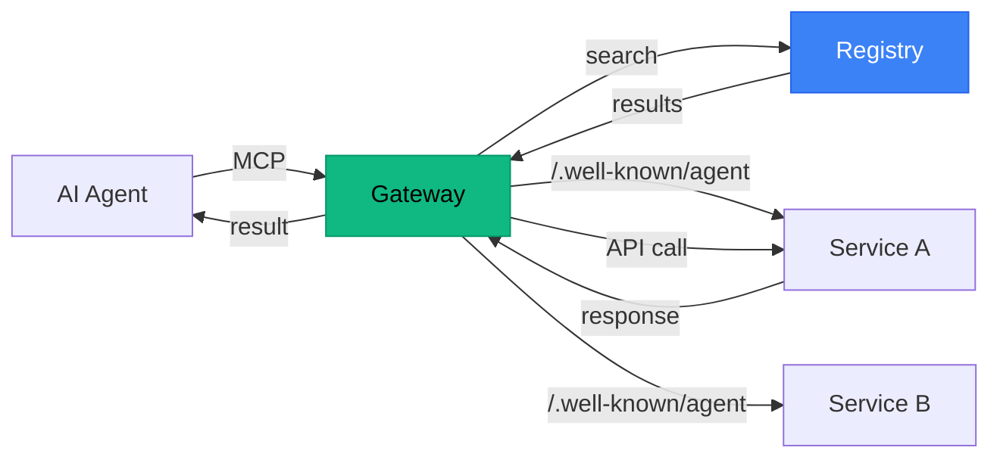

# Agent Discovery Protocol

**The DNS for AI Agents.**

One protocol. One gateway. Every API.

Instead of installing a separate MCP server for every service your AI agent might need, use the Agent Discovery Protocol. Services describe themselves at `/.well-known/agent`, agents discover them at runtime through a searchable registry, and a single gateway handles all communication.

```
Today:   Agent → MCP-Slack + MCP-Gmail + MCP-Stripe + MCP-GitHub + MCP-Calendar + ...
         (install, configure, and maintain each one)

ADP:     Agent → Agent Gateway (one install)
         → discovers and calls any service on demand
```

## How It Works



1. **Service** adds a `/.well-known/agent` JSON endpoint describing its capabilities
2. **Registry** crawls and indexes it — services become searchable by intent
3. **Agent** discovers services through the gateway, authenticates, and calls APIs — all at runtime

## Project Structure

```
agent-discovery-protocol/
├── spec/               # The protocol specification
│   ├── README.md       # Full spec document
│   └── examples/       # Example manifests and capability details
├── registry/           # AgentDNS — Next.js 14 registry app
│   ├── src/app/        # Pages: landing, directory, docs, submit, playground
│   ├── src/lib/        # Database, validator, crawler
│   └── src/components/ # Shared UI components
└── gateway-mcp/        # The only MCP server you need
    ├── src/            # MCP server, auth, discovery, caller, init
    └── README.md       # Gateway documentation
```

| Component | Description | Tech |
|-----------|-------------|------|
| **Spec** | Protocol definition and examples | Markdown, JSON |
| **Registry** | Searchable index + marketplace | Next.js 14, SQLite, Tailwind |
| **Gateway MCP** | Single MCP server for all APIs | TypeScript, MCP SDK |

## Quick Start

### For Agent Developers

```bash
# Install the gateway
npm install -g agent-gateway-mcp

# Sign in (opens browser)
agent-gateway init

# Add to your MCP client config
```

```json
{
  "mcpServers": {
    "gateway": {
      "command": "agent-gateway-mcp"
    }
  }
}
```

Your agent now has access to every service in the registry.

### For Service Providers

Add one endpoint to your API:

```javascript
// Express.js
app.get('/.well-known/agent', (req, res) => {
  res.json({
    spec_version: "1.0",
    name: "Your API",
    description: "What your API does.",
    base_url: "https://api.example.com",
    auth: { type: "none" },
    capabilities: [
      {
        name: "your_capability",
        description: "What this capability does",
        detail_url: "/api/capabilities/your_capability"
      }
    ]
  });
});
```

Then submit your domain to the registry at [agentdns.dev/submit](https://agentdns.dev/submit).

## Local Development

### Registry

```bash
cd registry
npm install
npm run dev
# → http://localhost:3000
```

### Gateway MCP

```bash
cd gateway-mcp
npm install
npm run build
npm run start    # Starts MCP server
npm run init     # Interactive setup
```

### Spec

The spec lives in `/spec/README.md`. Example manifests and capability details are in `/spec/examples/`.

## The Three Principles

1. **Simplicity over completeness** — The spec fits on one page. If it feels complex, simplify.
2. **Lazy loading** — Agents only fetch what they need (drill-down, not dump-everything).
3. **Web-native** — Just HTTP endpoints. No custom protocols, no WebSocket requirements.

## Why Not Just MCP?

MCP solves agent-to-service communication, but requires installing a separate server per service. This creates:

- **Configuration sprawl** — Every service needs its own config entry with API keys
- **Context pollution** — All tools loaded into the agent's context, whether needed or not
- **Discovery gap** — You need to know a service exists before you can install its MCP server
- **No portability** — Set up a new machine, redo all configurations

The Agent Discovery Protocol adds a **discovery layer** on top. Services describe themselves, agents find them at runtime. One gateway replaces all MCP servers.

| | N MCP Servers | 1 Agent Gateway |
|---|---|---|
| **Install** | Each one separately | Once |
| **New service** | Install + configure | Discovered at runtime |
| **New machine** | Reconfigure everything | Sign in, done |
| **Context window** | All tools loaded | Only what's needed |
| **Auth** | Per-service config | Cloud-synced |

## Roadmap

- [x] Protocol specification v1.0
- [x] Registry with directory, search, validation, crawler
- [x] Gateway MCP with 6 tools
- [x] Identity-first auth (Google/GitHub/Microsoft)
- [x] Cloud-synced token storage
- [x] Disk-backed caching (24h/1h/15min TTLs)
- [x] Documentation (providers, agents, spec, API reference)
- [x] Stripe Connect marketplace integration
- [x] Provider onboarding (Connect with Stripe)
- [x] User payment setup (Stripe Elements)
- [x] Subscription management (create, cancel, upgrade/downgrade)
- [x] Webhook handling (invoice events, account updates)
- [x] Platform fee (10% via application_fee_percent)
- [x] Billing page and transaction history
- [x] Registry account dashboard (OAuth login + account management)
- [ ] Push notifications for payment confirmation
- [x] SDK packages for popular frameworks (Express, FastAPI, Next.js, Spring Boot)
- [ ] Rate limiting and usage analytics
- [x] Service health monitoring

## Contributing

Contributions are welcome. This is an open protocol — the more services adopt it, the more valuable it becomes for everyone.

1. Fork the repo
2. Create a feature branch: `git checkout -b feature/my-feature`
3. Commit your changes: `git commit -m "feat: add my feature"`
4. Push: `git push origin feature/my-feature`
5. Open a Pull Request

### Areas where help is needed

- **Adopt the spec**: Add `/.well-known/agent` to your API
- **Gateway improvements**: Better caching, error handling, retry logic
- **Registry UI**: Search improvements, service analytics, dashboards
- **SDK packages**: Framework-specific helpers (Express middleware, FastAPI decorator, etc.)
- **Documentation**: Tutorials, guides, real-world examples

## License

MIT
