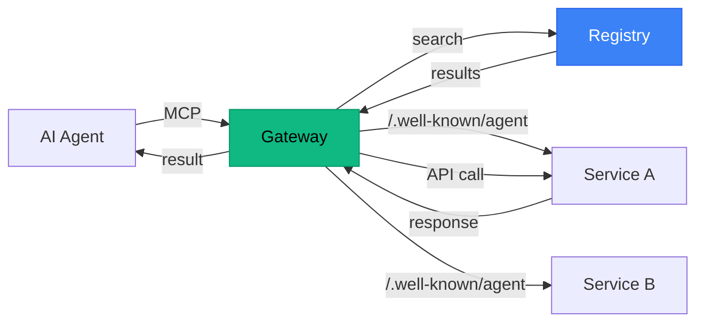

# Agent Discovery Protocol

**One MCP. One card. Every API your agent needs.**

Install the gateway, sign in once, add a card. Your agent now has access to dozens of services — Gmail, Stripe, OpenAI, GitHub, and more — without managing a single API key.

```
Today:   Agent → MCP-Slack + MCP-Gmail + MCP-Stripe + MCP-GitHub + MCP-Calendar + ...
         (install, configure, and maintain each one)

ADP:     Agent → Agent Gateway (one install)
         → discovers and calls any enabled service on demand
```

## How It Works



1. **Service** publishes a `/.well-known/agent` JSON endpoint describing its capabilities
2. **Registry** crawls and indexes it — services become searchable by intent
3. **User** runs `agent-gateway config` once to sign in, add a card, enable services
4. **Agent** discovers and calls those services through the gateway, at runtime

## The three pillars

- **Plug & play** — install the MCP, run `agent-gateway config`, done. No per-service setup.
- **One card** — pay us, we pay providers. Pay-per-use. No subscriptions to manage.
- **Lazy by default** — your agent only sees what you've enabled. No context bloat.

## Project Structure

```
agent-discovery-protocol/
├── spec/               # The protocol specification
│   ├── README.md       # Full spec document
│   └── examples/       # Example manifests and capability details
├── registry/           # AgentDNS — Next.js 14 registry app
│   ├── src/app/        # Pages: landing, directory, docs, submit, account
│   ├── src/lib/        # Database, validator, crawler
│   └── migrations/     # Postgres migrations
├── gateway-mcp/        # The only MCP server you need
│   ├── src/            # MCP server, discovery, caller, config flow
│   └── README.md       # Gateway documentation
└── tools/              # Internal manifest-generation tools
```

| Component | Description | Tech |
|-----------|-------------|------|
| **Spec** | Protocol definition and examples | Markdown, JSON |
| **Registry** | Searchable index + setup backend | Next.js 14, Postgres, Tailwind |
| **Gateway MCP** | Single MCP server for all APIs | TypeScript, MCP SDK |

## Quick Start

### For agent developers

```bash
# Install the gateway
npm install -g agent-gateway-mcp

# Run setup (opens a local web page in your browser)
agent-gateway config
# → sign in with Google
# → add a payment method (only needed for paid services)
# → toggle the services you want available
```

Then add it to your MCP client:

```json
{
  "mcpServers": {
    "gateway": {
      "command": "agent-gateway-mcp"
    }
  }
}
```

Your agent now has access to every service you enabled.

### For service providers

Add one endpoint to your API:

```javascript
// Express.js
app.get('/.well-known/agent', (req, res) => {
  res.json({
    spec_version: "1.0",
    name: "Your API",
    description: "What your API does.",
    base_url: "https://api.example.com",
    auth: { type: "none" },
    capabilities: [
      {
        name: "your_capability",
        description: "What this capability does",
        detail_url: "/api/capabilities/your_capability"
      }
    ]
  });
});
```

Then submit your domain at [agent-dns.dev/submit](https://agent-dns.dev/submit). Verified within ~48 hours.

## Local Development

### Registry

```bash
cd registry
npm install
cp .env.example .env.local   # fill in DATABASE_URL, OAuth secrets, etc.
npm run dev
# → http://localhost:3000
```

The registry uses Postgres. The schema auto-initializes on first run via `initSchema` in `src/lib/db.ts`. Migrations under `migrations/` are applied manually with `psql` for incremental changes.

### Gateway MCP

```bash
cd gateway-mcp
npm install
npm run build
npm run config     # opens the local setup page
```

### Spec

The spec lives in `/spec/README.md`. Example manifests are in `/spec/examples/`.

## The MCP tools

The gateway exposes three tools to the agent:

- **`discover`** — browse and search the user's enabled services. Default mode is enabled-only; pass `browse_catalog: true` to search the full catalog (results are read-only outside the enabled set).
- **`call`** — execute a capability on an enabled service. The gateway handles auth, request construction, and rate limiting.
- **`list_connections`** — list enabled services with auth and local usage info.

All billing and account setup happens in `agent-gateway config` (not in MCP tools), so the agent can never auto-approve payments.

## Why not just MCP?

MCP solves agent-to-service communication, but requires installing a separate server per service. This creates:

- **Configuration sprawl** — every service needs its own config entry with API keys
- **Context pollution** — all tools loaded into the agent's context, whether needed or not
- **Discovery gap** — you need to know a service exists before you can install its MCP server
- **No portability** — set up a new machine, redo all configurations

The Agent Discovery Protocol adds a **discovery layer** on top. Services describe themselves; agents find them at runtime. One gateway replaces all MCP servers.

| | N MCP Servers | 1 Agent Gateway |
|---|---|---|
| **Install** | Each one separately | Once |
| **New service** | Install + configure | Toggle in `agent-gateway config` |
| **New machine** | Reconfigure everything | Sign in, done |
| **Context window** | All tools loaded | Only enabled services |
| **Auth & billing** | Per-service config | One card, one account |

## Roadmap

### Live

- [x] Protocol specification v1.0
- [x] Registry with directory, search, validation, crawler
- [x] Gateway MCP with three tools (`discover`, `call`, `list_connections`)
- [x] Local web-based setup flow (`agent-gateway config`)
- [x] OAuth identity (Google/GitHub) for the registry
- [x] Disk-backed caching (manifests, capabilities, discovery)
- [x] Documentation (providers, agents, spec, API reference)
- [x] Trust levels (verified / community / unverified)
- [x] 240+ community API manifests
- [x] Acceptable Use Policy v1

### Coming Soon

- [ ] Per-call usage tracking and monthly Stripe invoicing
- [ ] Cross-machine usage aggregation in the CLI
- [ ] Spending caps per service in the setup page
- [ ] Microsoft and additional OAuth providers
- [ ] Public AUP page
- [ ] Community manifest program (PR-based contributions)
- [ ] SDK packages on npm / PyPI / Maven
- [ ] IETF Internet-Draft submission

## Design docs

- [`docs/pivot-unified-billing.md`](docs/pivot-unified-billing.md) — current architecture and design rationale
- [`docs/auth-broker-design.md`](docs/auth-broker-design.md) — auth model (still valid for the OAuth-broker pieces)
- [`docs/aup.md`](docs/aup.md) — Acceptable Use Policy draft
- [`docs/tos-audit.md`](docs/tos-audit.md) — third-party ToS classification used to pick v1 services

## Contributing

Contributions are welcome. This is an open protocol — the more services adopt it, the more valuable it becomes for everyone.

1. Fork the repo
2. Create a feature branch: `git checkout -b feature/my-feature`
3. Commit your changes: `git commit -m "feat: add my feature"`
4. Push: `git push origin feature/my-feature`
5. Open a Pull Request

### Areas where help is needed

- **Adopt the spec**: add `/.well-known/agent` to your API
- **Gateway improvements**: better caching, error handling, retry logic
- **Registry UI**: search improvements, service analytics
- **SDK packages**: framework-specific helpers (Express middleware, FastAPI decorator, etc.)
- **Documentation**: tutorials, guides, real-world examples

## License

MIT
