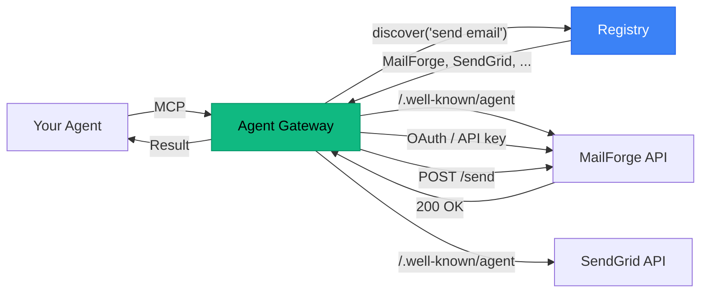

# Agent Gateway MCP

**One MCP server. Every API. Zero configuration per service.**

Your agent's web browser. Instead of installing a separate MCP server for every service your agent might need, install this one gateway and let your agent discover and use any API at runtime.

```
Today:   Agent → MCP-Slack + MCP-Gmail + MCP-Stripe + MCP-GitHub + MCP-Calendar + ...
         (install, configure, and maintain each one)

Gateway: Agent → Agent Gateway (one install)
         → discovers and calls any service on demand
```

## Quick Start

```bash
# Install globally
npm install -g agent-gateway-mcp

# Sign in (opens browser → Sign in with Google/GitHub/Microsoft)
agent-gateway init

# Add to your MCP client config — that's it
```

Add this to your MCP client (Claude Desktop, Cursor, etc.):

```json
{
  "mcpServers": {
    "gateway": {
      "command": "agent-gateway-mcp"
    }
  }
}
```

Custom registry:

```json
{
  "mcpServers": {
    "gateway": {
      "command": "agent-gateway-mcp",
      "args": ["--registry", "https://your-registry.dev"]
    }
  }
}
```

## How It Works



**The flow:**

1. Agent asks: *"Send an email to Alice"*
2. Gateway searches the registry: *"send email"*
3. Registry returns matching services (MailForge, SendGrid, ...)
4. Agent picks one, gateway fetches its `/.well-known/agent` manifest
5. Agent drills into the `send_email` capability for full details
6. Gateway handles auth (OAuth2 / API key), constructs the HTTP request, calls the API
7. Response flows back to the agent

No MCP plugin was installed for MailForge. No configuration file was edited. The agent discovered it, connected, and used it — all at runtime.

## Architecture

```
~/.agent-gateway/
├── config.json              # Registry URL, identity, sync state
├── tokens.json              # Service tokens and connections
└── cache/
    ├── manifests/           # /.well-known/agent manifests (24h TTL)
    ├── details/             # Capability details (1h TTL)
    └── discovery/           # Registry search results (15min TTL)
```

**Identity-first auth:** Your Google/GitHub/Microsoft account is your identity. Sign in once, and all your service connections are stored on the registry and synced across machines. Set up a new machine? `agent-gateway init` → sign in → all connections restored.

**Cloud-synced tokens:** Tokens are encrypted at rest on the registry. Local cache in `~/.agent-gateway/` for speed. New connections auto-sync to cloud.

**Smart caching:** Three-tier TTLs prevent unnecessary network calls:
- **Manifests**: 24 hours (service capabilities rarely change)
- **Capability details**: 1 hour (endpoints and schemas are stable)
- **Discovery results**: 15 minutes (new services may appear)

Both in-memory hot cache and disk-backed persistent cache.

## Tool Reference

### `discover` — Find and explore services

Search the registry by intent, explore a domain's manifest, or drill into a capability.

```
# Search by intent
discover({ query: "send email" })

# Explore a specific service
discover({ domain: "api.mailforge.dev" })

# Get full capability details
discover({ domain: "api.mailforge.dev", capability: "send_email" })
```

**Parameters:**
| Name | Type | Description |
|------|------|-------------|
| `query` | string? | Natural language search (e.g. "send email", "create invoice") |
| `domain` | string? | Specific domain to explore |
| `capability` | string? | Capability name to drill into (requires `domain`) |

### `call` — Execute a capability

Calls a capability on a service. The gateway handles everything: auth, request construction, and execution.

```
call({
  domain: "api.mailforge.dev",
  capability: "send_email",
  params: {
    to: "alice@example.com",
    subject: "Hello",
    body: "Hi Alice!"
  }
})
```

**Parameters:**
| Name | Type | Description |
|------|------|-------------|
| `domain` | string | Service domain |
| `capability` | string | Capability name |
| `params` | object? | Parameters for the capability |
| `api_key` | string? | API key (if service requires one and you haven't connected) |

### `auth` — Connect to a service

Initiates authentication with a service. Handles OAuth2 (browser flow), API keys, and public APIs.

```
# OAuth2 service (opens browser)
auth({ domain: "api.mailforge.dev" })

# API key service
auth({ domain: "api.weather.io", api_key: "sk-abc123" })
```

**Parameters:**
| Name | Type | Description |
|------|------|-------------|
| `domain` | string | Service domain to connect to |
| `api_key` | string? | API key (for api_key auth type services) |

### `subscribe` — Subscribe to a paid plan

Shows plan details and initiates payment. The agent **never** auto-approves payments — always requires human confirmation via push notification or browser.

```
subscribe({ domain: "api.invoicing.io", plan: "Pro" })
```

### `manage_subscriptions` — Manage existing subscriptions

```
# List all subscriptions
manage_subscriptions({})

# Cancel a subscription
manage_subscriptions({ domain: "api.invoicing.io", action: "cancel" })

# Upgrade
manage_subscriptions({ domain: "api.invoicing.io", action: "upgrade", plan: "Enterprise" })
```

### `list_connections` — View connected services

```
# List all
list_connections({})

# Details for one service
list_connections({ domain: "api.mailforge.dev" })
```

## End-to-End Demo

Here's what a real agent conversation looks like with the gateway:

```
User: "Send an invoice to Acme Corp for $5,000"

Agent → discover({ query: "create invoice" })
Gateway: Found 2 services:
  InvoiceNinja (api.invoiceninja.com) [NOT CONNECTED]
    - create_invoice: Create and send a professional invoice
  BillingBot (api.billingbot.io) [NOT CONNECTED]
    - create_invoice: Generate invoices with templates

Agent → discover({ domain: "api.invoiceninja.com", capability: "create_invoice" })
Gateway: create_invoice — InvoiceNinja
  Endpoint: POST https://api.invoiceninja.com/v1/invoices
  Parameters:
    - client_name (string, required): Client company name
    - amount (number, required): Invoice amount in cents
    - currency (string, optional): ISO currency code. Default: USD
    - ...

Agent → auth({ domain: "api.invoiceninja.com" })
Gateway: InvoiceNinja requires an API key.
  Get your key at: https://app.invoiceninja.com/settings/api
  Provide it with: auth({ domain: "api.invoiceninja.com", api_key: "..." })

User: "Here's my key: INJ-abc123"

Agent → auth({ domain: "api.invoiceninja.com", api_key: "INJ-abc123" })
Gateway: API key stored for InvoiceNinja. Connected.

Agent → call({
  domain: "api.invoiceninja.com",
  capability: "create_invoice",
  params: {
    client_name: "Acme Corp",
    amount: 500000,
    currency: "USD",
    description: "Consulting services"
  }
})
Gateway: create_invoice on api.invoiceninja.com — HTTP 201
  { "invoice_id": "INV-2024-0042", "status": "sent", "pdf_url": "..." }

Agent: "Done! Invoice INV-2024-0042 for $5,000 has been sent to Acme Corp."
```

The agent discovered InvoiceNinja, learned how to use it, authenticated, and called it — all through one gateway. No MCP plugin for InvoiceNinja was installed.

## Comparison

| | N MCP Servers | 1 Agent Gateway |
|---|---|---|
| **Install** | `npm install` each one | `npm install` once |
| **Configure** | Edit JSON per service | `agent-gateway init` (one time) |
| **New service** | Install new MCP server | Agent discovers it at runtime |
| **Auth** | Configure per service | Cloud-synced, auto-managed |
| **New machine** | Reconfigure everything | `agent-gateway init` → sign in → done |
| **Context window** | Polluted with all tools | Only active tools loaded |
| **Maintenance** | Update each server | Update one package |
| **Discovery** | You must know it exists | Search by intent |

## CLI Reference

### `agent-gateway init`

Interactive setup. Opens browser for identity provider sign-in, syncs existing connections.

```bash
agent-gateway init                                    # Default (Google)
agent-gateway init --provider github                  # Use GitHub
agent-gateway init --provider microsoft               # Use Microsoft
agent-gateway init --registry https://custom.dev      # Custom registry
```

### `agent-gateway-mcp`

Starts the MCP server (used by MCP clients, not run manually).

```bash
agent-gateway-mcp                                     # Default registry
agent-gateway-mcp --registry https://custom.dev       # Custom registry
```

## Security

- **Tokens encrypted at rest** on the registry
- **Local cache** in `~/.agent-gateway/` (user-only permissions)
- **OAuth2 with PKCE** for browser-based auth flows
- **No master password** — your identity provider handles authentication
- **Human-in-the-loop for payments** — the agent can never auto-approve subscriptions
- **Token auto-refresh** — expired OAuth2 tokens are refreshed transparently

## Protocol

This gateway implements the [Agent Discovery Protocol](../spec/README.md) — an open standard for service-to-agent communication via `/.well-known/agent` manifests. Any service that implements the spec is instantly accessible through this gateway.

## License

MIT
